# Progetto Spring Boot: A Caccia di Sapere

## 1. Preparazione dell'ambiente di sviluppo

Per iniziare, assicurati di avere installato un IDE compatibile con Java, come **Eclipse**. Puoi scaricarlo direttamente da [questo link](https://www.eclipse.org/downloads/download.php?file=/oomph/epp/2024-09/R/eclipse-inst-jre-win64.exe). Durante l'installazione, seleziona l'opzione **Java Developer**.

## 2. Configurazione di Spring Boot in Eclipse

Una volta completata l'installazione di Eclipse, segui questi passaggi per configurare il framework Spring Boot tramite l'Eclipse Marketplace.

### Procedura:

1. Apri il menu **Help** e seleziona **Eclipse Marketplace**.
    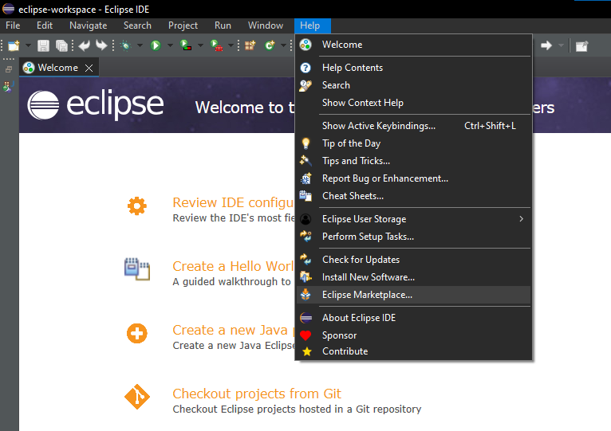

2. Cerca **Spring Boot** utilizzando la barra di ricerca.

3. Installa la **versione 4 di Spring Boot**.
    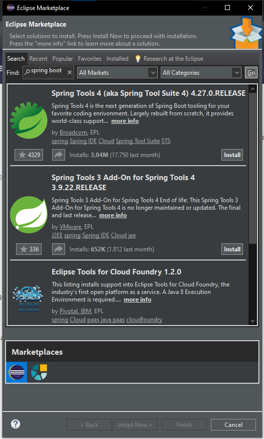

4. Procedi con l'installazione selezionando **Trust Selected** quando richiesto.
    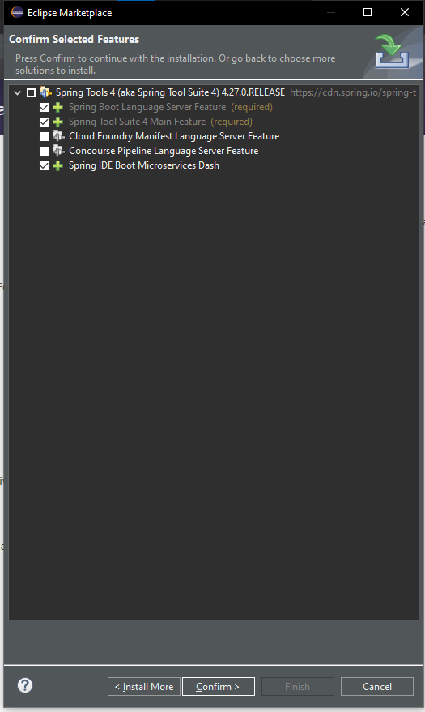
    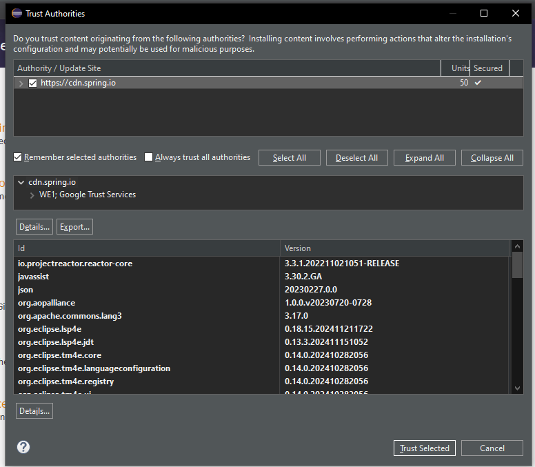
    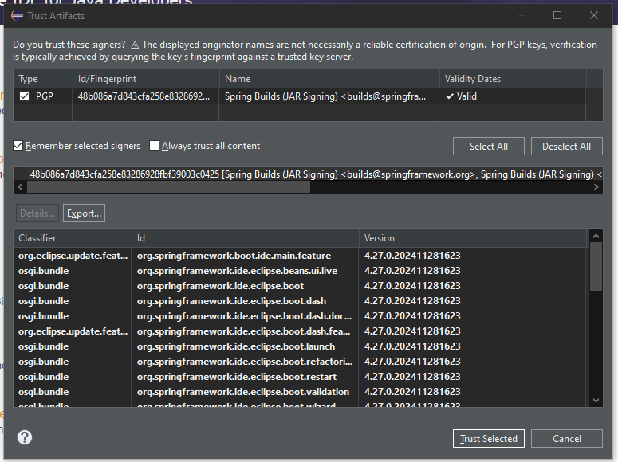

## 3. Installazione di un Gestore di Server

Scarica e installa un gestore di server come **XAMPP** dal [sito ufficiale](https://www.apachefriends.org/it/index.html).

## 4. Configurazione del Database con XAMPP

### Procedura:

1. Dopo aver installato XAMPP, avvia i servizi **MySQL** e **Apache** premendo il pulsante **Start**.
    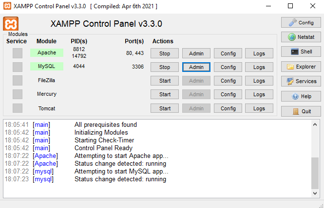

2. Clicca su **Admin** accanto a **MySQL** per accedere a [phpMyAdmin](http://localhost/phpmyadmin/index.php). Qui, crea un nuovo database chiamato **democr8**.
    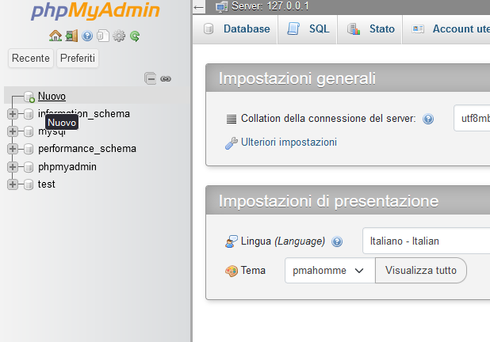
    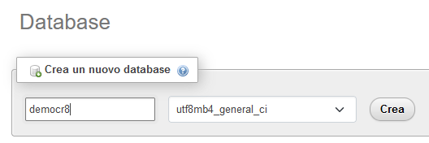

## 5. Importazione del Progetto in Eclipse

### Procedura:

1. Nel menu **File** in alto, seleziona **Import**.
    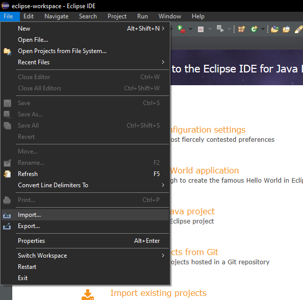

2. Scegli l'opzione **Existing Maven Projects**.
    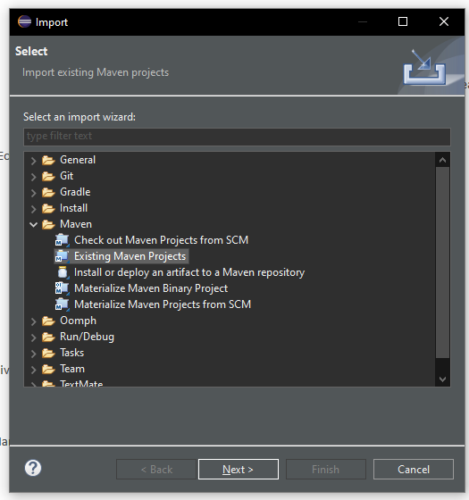

3. Seleziona la directory che contiene il progetto e clicca su **Finish**.
    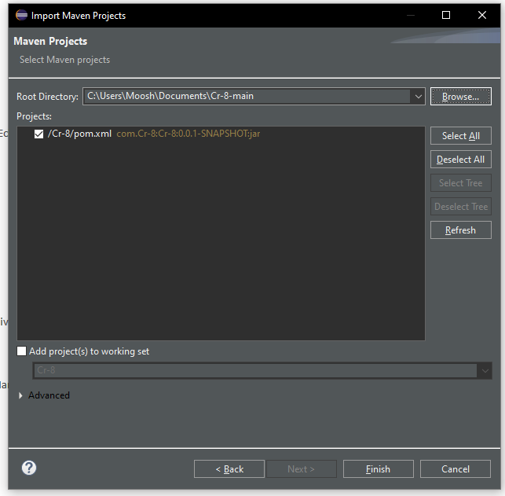

## 6. Avvio dell'Applicazione

### Istruzioni per l'avvio:

1. **Esecuzione del progetto**: Dopo la compilazione, seleziona in alto **Boot Dashboard** e successivamente vai nella sezione in basso, espandi la lista **local**, clicca con il tasto destro su **Cr-8** e seleziona **(Re)start**. L'applicazione verrà avviata sul server locale (porta predefinita: 8080).
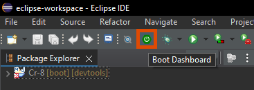
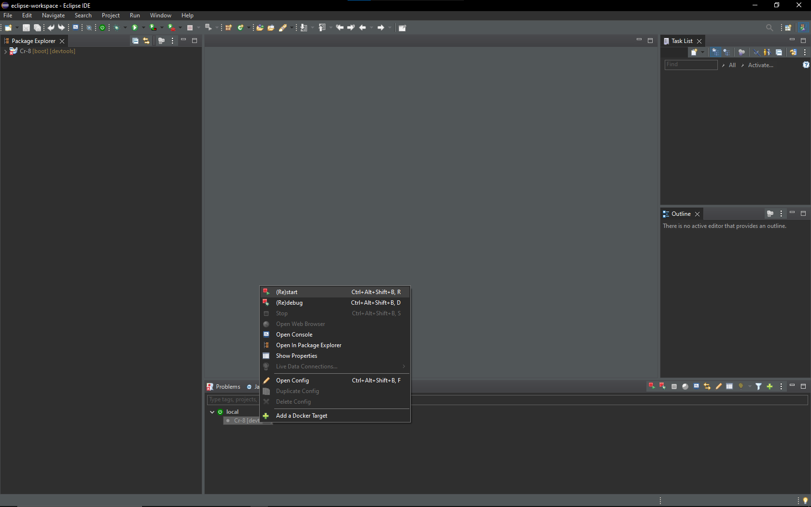

2. **Verifica dell'avvio**: Apri un browser e vai all'indirizzo [http://localhost:8080](http://localhost:8080) per visualizzare l'applicazione in funzione.

---
