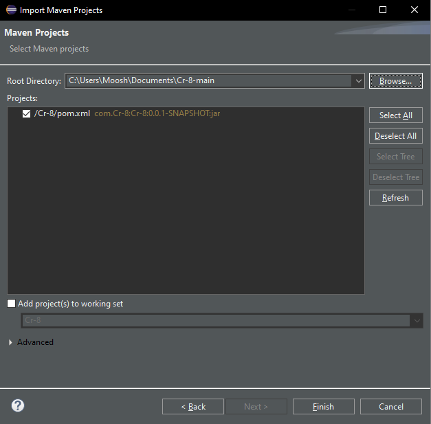

# Spring Boot Project: "A Caccia di Sapere"

Follow this comprehensive guide to set up your environment, configure necessary tools, and launch the application with ease.

---

## 1. Setting Up the Development Environment

Before diving into the project, ensure you have a **Java-compatible IDE**. We recommend **Eclipse**, which can be downloaded directly from [this link](https://www.eclipse.org/downloads/download.php?file=/oomph/epp/2024-09/R/eclipse-inst-jre-win64.exe).

### Installation Steps:

1. Download the installer and run it.
2. During installation, select the **Java Developer** option.

---

## 2. Configuring Spring Boot in Eclipse

Configure Spring Boot in Eclipse by following these steps:

### Step-by-Step Guide:

1. Navigate to the **Help** menu and click **Eclipse Marketplace**. 
   
    
2. Use the search bar to find **Spring Boot**.
    
3. Install **Spring Boot version 4** for compatibility. 
   
    
4. During installation, select **Trust Selected** when prompted. 
    
    
    

---

## 3. Installing a Server Manager

To manage your database and server, download **XAMPP** from the [official website](https://www.apachefriends.org/index.html). This tool provides an easy-to-use interface for handling services like MySQL and Apache.

---

##  4. Setting Up the Database with XAMPP

A properly configured database is essential for the application to function correctly. Here's how to set it up:

### Steps to Follow:

1. Launch **XAMPP** and start the **MySQL** and **Apache** services by clicking **Start**. 
   
    

2. Access [phpMyAdmin](http://localhost/phpmyadmin/index.php) by clicking **Admin** next to **MySQL**.
 

3. Create a new database named **democr8**. 
     
   

   Your database is now ready.

---

## 5. Importing the Project into Eclipse

Once your environment is set up, it's time to import the project into Eclipse.

### Follow These Steps:

1. Open Eclipse and go to the **File** menu, then select **Import**. 
   
    

2. Choose **Existing Maven Projects**. 
   
    

3. Browse to the folder containing the project files, then click **Finish**. 
    
   The project is now loaded and ready to be worked on.

---

## 6. Running the Application

With everything in place, you’re ready to run the application.

### How to Run:

1. **Start the Project**:  
   - Navigate to the **Boot Dashboard** at the top.  
   - In the **local** section, find **Cr-8**, right-click, and select **(Re)start**.  
       
     

2. **Check the Application**:  
   - Open your browser and go to [http://localhost:8080](http://localhost:8080).  
   - If everything is configured correctly, you’ll see the application up and running.  

---
