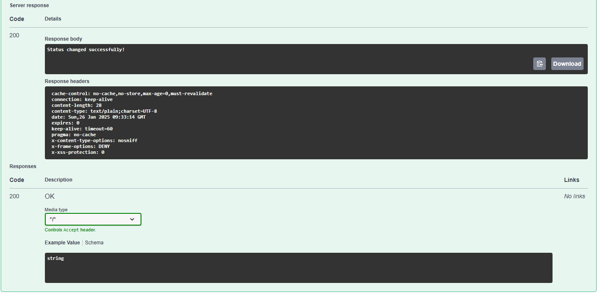

# How to Use the Swagger User Interface  

The **Swagger UI** provides a user-friendly interface for testing and interacting with the various API endpoints of our application. Follow this guide to learn how to access, explore, and use the Swagger interface effectively.  

---

## Accessing Swagger UI  

To open the Swagger UI:  

1. Start the project server.  
2. Open your web browser and navigate to [http://localhost:8080/swagger](http://localhost:8080/swagger).  
3. You’ll see a page resembling this:  
     

At this point, you can click on any **Endpoint** to view its details and interact with it.  

---

## Endpoint Groups  

Endpoints in the Swagger UI are organized into the following groups:  

- **Dashboard Endpoint**: Restricted to admins and callable through the dashboard.  
- **Public Endpoint**: Openly accessible to all visitors.  
- **auth-controller**: Contains endpoints for verifying authentication codes.  

  

---

## GET Calls  

GET requests are used to retrieve information from the server.  

### How to Send a GET Request  

1. Expand the desired endpoint by clicking on it.  
2. Press the **Try it out** button.  
     

3. Click **Execute** to send the request.  
     

4. The server’s response will appear at the bottom of the endpoint box. A **200** response code indicates success.  
     

---

## POST Calls  

POST requests are used to send data to the server.  

### How to Send a POST Request  

1. Expand the endpoint and press the **Try it out** button.  
     

2. Fill in the required data:  
   - **Individual Fields**: Enter values directly into the provided input fields.  
   - **JSON Payload**: Edit the example JSON provided by Swagger.
     
     
     

3. Press **Execute** to send the request. The server’s response will include a status code:  
   - **200**: The operation was successful.  
       
   - **400**: Client error (e.g., incorrect or improperly formatted data).  
       
   - **500**: Server error (e.g., unresolved internal issues).  
       

---

## DELETE Calls  

DELETE requests are used to remove data from the server’s database.  

### How to Send a DELETE Request  

1. Expand the endpoint and press the **Try it out** button.  
     

2. Enter the ID of the entry you want to delete in the required field.  
     

3. Click **Execute** to perform the operation. The server’s response will indicate the result:  
   - **200**: The operation was successful.  
       
   - **400**: Client error (e.g., incorrect or missing data).  
       
   - **500**: Server error (e.g., unresolved issues in the server code).  
       

---

## Final Notes  

- Ensure that the server is running before accessing the Swagger UI.  
- Always validate your inputs before executing any request.  
- For a complete guide on using Swagger, refer to the [official documentation](https://swagger.io/tools/swagger-ui/).
