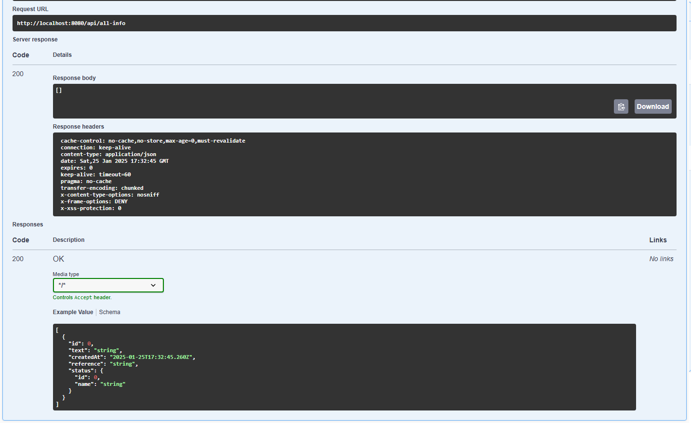

# How to use the Swagger User Interface

The Swagger UI is a simple way to test out the various API calls that you can initiate through our application.

To access the Swagger UI, start the project, open your browser and head to [http://localhost:8080/swagger](http://localhost:8080/swagger). You will see something like this:

At this point you can click on any Endpoint to expand its details.

The operations you can do in each Endpoint depend on the type of call you want to initiate. For example GET calls don't accept parameters, while POST and DELETE calls do.

---

## Endpoint groups

The endpoints are divided in three groups:

- **Dashboard Endpoint**: these endpoints are callable through the dashboard, and therefore exclusive to admins.

- **Public Endpoint**: these endpoints are public, so accessable by visitors.

- **auth-controller**: in this section there is an endpoint to verify if an authentication code is valid.

---

## GET calls

The client can cast GET calls to retrieve information, in order to send a GET call you have to:

1. Press the **Try it out** button.

2. Press the **Execute** button.

3. At the bottom of the endpoint box you will find the response to the call. The response code should always be 200, which means that no errors were found.

---

## POST calls

The client can cast POST calls to send data to the server, in order to send a POST call you have to:

1. Press the **Try it out** button.

2. Insert the data to send, depending on the call, you will either have to fill out individual fields, or send a JSON query. In the JSON case, Swagger will assist you with an example JSON that you can modify.

3. After inserting the required data, you can press the **Execute** button. The server will then respond with information on how the operation went.

If the inserted data is incorrectly formatted, you can get various error messages
